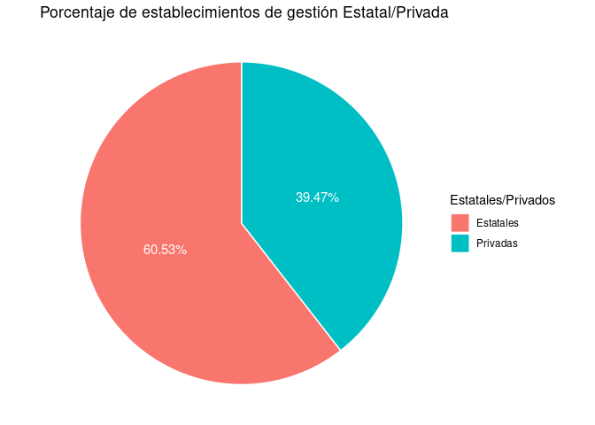

Proyecto Ciencia de Datos II - Establecimientos Educativos en CABA
================
Maxi Urso
2023-08

La ciudad elegida es la Ciudad Autónoma de Buenos Aires. Se indagará
sobre la información referida a establecimientos educativos dentro de la
misma. La fuente de datos de los establecimientos educativos se tomará
del portal [BA
Data](https://data.buenosaires.gob.ar/dataset/establecimientos-educativos).

Se buscará analizar brevemente cómo están distribuídos los
establecimientos educativos dentro de la CABA realizando una comparación
entre niveles y modalidades según la dependencia funcional a la que
pertenecen y cómo están distribuídas en las 15 comunas. Para afinar el
análisis, se cruzará la información georeferenciada de los
establecimientos educativos con la base de censo 2010 para el AMBA
trabajado en este curso. Por último, se buscará realizar una comparación
entre la cantidad de escuelas de gestión estatal y de gestión privada en
relación a la cantidad de población de cada una de las comunas de la
ciudad.

# Importo librerías

``` r
library(tidyverse)
library(sf)
library(ggplot2)
library(scales)
library(ggmap)
```

# Levanto base establecimientos educativos

``` r
escuelas <- read_csv('data/establecimientos_educativos_WGS84.csv')
```

# Veo dimensión de la base

``` r
dim(escuelas)
```

    ## [1] 2973   27

**2973 registros, 27 columnas.**

# Veo columnas de la base escuelas

``` r
colnames(escuelas)
```

    ##  [1] "cui"        "cueanexo"   "cue"        "anexo"      "sector"    
    ##  [6] "dom_edific" "dom_establ" "nombre_est" "nombre_abr" "telefono"  
    ## [11] "email"      "codpost"    "web_megcba" "nivmod"     "nivelmodal"
    ## [16] "tipest_abr" "tipest"     "depfun"     "depfun_otr" "de"        
    ## [21] "comuna"     "barrio"     "area_progr" "estado"     "point_x"   
    ## [26] "point_y"    "nivel"

# Selecciono columnas

Dejo las columnas con las que me voy a quedar:

- cue: Código único de escuela

- nombre_abr: Nombre del establecimiento

- depfun: Dependencia funcional

- de: Distrito Escolar

- comuna

``` r
escuelas <- escuelas %>% 
  select(cue,nombre_abr,depfun,de,comuna)
```

# Inspecciono campos

``` r
summary(escuelas)
```

    ##       cue          nombre_abr           depfun                de        
    ##  Min.   :200001   Length:2973        Length:2973        Min.   : 1.000  
    ##  1st Qu.:200843   Class :character   Class :character   1st Qu.: 4.000  
    ##  Median :201598   Mode  :character   Mode  :character   Median : 9.000  
    ##  Mean   :201844                                         Mean   : 9.637  
    ##  3rd Qu.:202401                                         3rd Qu.:15.000  
    ##  Max.   :290030                                         Max.   :21.000  
    ##      comuna      
    ##  Min.   : 1.000  
    ##  1st Qu.: 4.000  
    ##  Median : 8.000  
    ##  Mean   : 7.654  
    ##  3rd Qu.:11.000  
    ##  Max.   :15.000

## Cantidad de escuelas por dependencia funcional

``` r
table(escuelas$depfun)
```

    ## 
    ##                                               Dirección de Educación Artística 
    ##                                                                             57 
    ##                            Dirección de Educación del Adulto y del Adolescente 
    ##                                                                            367 
    ##                                                Dirección de Educación Especial 
    ##                                                                             54 
    ##                                                 Dirección de Educación Inicial 
    ##                                                                            432 
    ##                                                   Dirección de Educación Media 
    ##                                                                            106 
    ##                                                Dirección de Educación Primaria 
    ##                                                                            503 
    ##                                                 Dirección de Educación Técnica 
    ##                                                                             39 
    ##                                        Dirección de Educación Técnica Superior 
    ##                                                                              2 
    ##                                         Dirección de EducaciónTécnica Superior 
    ##                                                                             38 
    ##                                      Dirección de Escuelas Normales Superiores 
    ##                                                                             22 
    ##                              Dirección General de Educación de Gestión Privada 
    ##                                                                           1055 
    ##                                          Dirección General Escuela de Maestros 
    ##                                                                              5 
    ##                             Gerencia Operativa de Educación para el Desarrollo 
    ##                                                                             53 
    ##                                    Gerencia Operativa de Formación Profesional 
    ##                                                                            113 
    ## Gerencia Operativa Gestión y Administración de Institutos de Formación Docente 
    ##                                                                              6 
    ##                                                        GO de Formación Laboral 
    ##                                                                              1 
    ##                   Subsecretaría de Coordinación Pedagógica y Equidad Educativa 
    ##                                                                             86

# Filtrando elementos

Voy a quitar las dependencias funcionales con menos de 10
establecimientos

Para ello tengo que agrupar y contar.

Luego ordeno por dependencia funcional en orden descendente.

``` r
escuelas_agrup_depfun <- escuelas %>% 
  group_by(depfun) %>% 
  summarise(cantidad = n()) %>% 
  arrange(-cantidad)

print(escuelas_agrup_depfun)
```

    ## # A tibble: 18 × 2
    ##    depfun                                                               cantidad
    ##    <chr>                                                                   <int>
    ##  1 Dirección General de Educación de Gestión Privada                        1055
    ##  2 Dirección de Educación Primaria                                           503
    ##  3 Dirección de Educación Inicial                                            432
    ##  4 Dirección de Educación del Adulto y del Adolescente                       367
    ##  5 Gerencia Operativa de Formación Profesional                               113
    ##  6 Dirección de Educación Media                                              106
    ##  7 Subsecretaría de Coordinación Pedagógica y Equidad Educativa               86
    ##  8 Dirección de Educación Artística                                           57
    ##  9 Dirección de Educación Especial                                            54
    ## 10 Gerencia Operativa de Educación para el Desarrollo                         53
    ## 11 Dirección de Educación Técnica                                             39
    ## 12 Dirección de EducaciónTécnica Superior                                     38
    ## 13 <NA>                                                                       34
    ## 14 Dirección de Escuelas Normales Superiores                                  22
    ## 15 Gerencia Operativa Gestión y Administración de Institutos de Formac…        6
    ## 16 Dirección General Escuela de Maestros                                       5
    ## 17 Dirección de Educación Técnica Superior                                     2
    ## 18 GO de Formación Laboral                                                     1

## Me quedo con las dependencias funcionales con menos de 10 establecimientos

``` r
dep_funcs_chicas <- escuelas_agrup_depfun %>% 
  filter(cantidad < 10)

print(dep_funcs_chicas)
```

    ## # A tibble: 4 × 2
    ##   depfun                                                                cantidad
    ##   <chr>                                                                    <int>
    ## 1 Gerencia Operativa Gestión y Administración de Institutos de Formaci…        6
    ## 2 Dirección General Escuela de Maestros                                        5
    ## 3 Dirección de Educación Técnica Superior                                      2
    ## 4 GO de Formación Laboral                                                      1

Quiero eliminar de la base escuelas las que corresponden a estas
dependencias funcionales.

Para ello construyo una lista de las dependencias funcionales chicas

``` r
lista_dep_funcs_chicas <- dep_funcs_chicas$depfun

lista_dep_funcs_chicas
```

    ## [1] "Gerencia Operativa Gestión y Administración de Institutos de Formación Docente"
    ## [2] "Dirección General Escuela de Maestros"                                         
    ## [3] "Dirección de Educación Técnica Superior"                                       
    ## [4] "GO de Formación Laboral"

Ahora quito de la base esas escuelas

``` r
escuelas <- escuelas %>% 
  filter(!(depfun %in% lista_dep_funcs_chicas))
```

Chequeo que ya no estén.

``` r
table(escuelas$depfun)
```

    ## 
    ##                             Dirección de Educación Artística 
    ##                                                           57 
    ##          Dirección de Educación del Adulto y del Adolescente 
    ##                                                          367 
    ##                              Dirección de Educación Especial 
    ##                                                           54 
    ##                               Dirección de Educación Inicial 
    ##                                                          432 
    ##                                 Dirección de Educación Media 
    ##                                                          106 
    ##                              Dirección de Educación Primaria 
    ##                                                          503 
    ##                               Dirección de Educación Técnica 
    ##                                                           39 
    ##                       Dirección de EducaciónTécnica Superior 
    ##                                                           38 
    ##                    Dirección de Escuelas Normales Superiores 
    ##                                                           22 
    ##            Dirección General de Educación de Gestión Privada 
    ##                                                         1055 
    ##           Gerencia Operativa de Educación para el Desarrollo 
    ##                                                           53 
    ##                  Gerencia Operativa de Formación Profesional 
    ##                                                          113 
    ## Subsecretaría de Coordinación Pedagógica y Equidad Educativa 
    ##                                                           86

Veo que todas son mayores a 10.

# Chequeo si hay y elimino valores nulos

``` r
any(is.na(escuelas$depfun))
```

    ## [1] TRUE

``` r
escuelas <- drop_na(escuelas)
```

# Grafico cantidad de escuelas por dependencia funcional

``` r
ggplot(escuelas, aes(y = factor(depfun)))+
  geom_bar(fill = "steelblue", color = "black", stat = "count") +
  labs(title = "Establecimientos por Dependencia Funcional", y = "Dependencia funcional", x = "Cantidad")
```

<!-- -->

Se puede observar que la mayor cantidad de establecimientos educativos
corresponden a la Dirección General de Educación de Gestión Privada.
Bajo esa órbita están las escuelas de los diferentes niveles educativos
(primaria, inicial, secundaria), mientras que las escuelas de gestión
estatal están repartidas en diferentes direcciones.

A su vez, hay algunos establecimientos educativos que corresponden a
diferentes gerencias o subsecretarías que serán descartadas del
posterior análisis.

# Quito todo lo que sea gerencias

Y me quedo solo con las que contienen la palabra “Dirección”.

``` r
escuelas_direcciones <- escuelas %>% 
  filter(grepl("Dirección",depfun))

table(escuelas_direcciones$depfun)
```

    ## 
    ##                    Dirección de Educación Artística 
    ##                                                  57 
    ## Dirección de Educación del Adulto y del Adolescente 
    ##                                                 367 
    ##                     Dirección de Educación Especial 
    ##                                                  54 
    ##                      Dirección de Educación Inicial 
    ##                                                 432 
    ##                        Dirección de Educación Media 
    ##                                                 106 
    ##                     Dirección de Educación Primaria 
    ##                                                 503 
    ##                      Dirección de Educación Técnica 
    ##                                                  39 
    ##              Dirección de EducaciónTécnica Superior 
    ##                                                  38 
    ##           Dirección de Escuelas Normales Superiores 
    ##                                                  22 
    ##   Dirección General de Educación de Gestión Privada 
    ##                                                1055

# Gráficos de tortas

Voy a realizar algunos piecharts para conocer las proporciones de
escuelas por Dirección.

## Separo las de gestión privada y las de gestión estatal

Agrego un campo que indique si la escuela es de gestión estatal o
privada. Luego, calculo la cantidad y porcentaje de escuelas según
gestión.

``` r
escuelas_estatales_privadas <- escuelas_direcciones %>% 
  mutate(est_priv = case_when(depfun == "Dirección General de Educación de Gestión Privada" ~ 'Privadas',
                              .default = 'Estatales')) %>%
  group_by(est_priv) %>%
  summarise(cantidad = n()) %>%
  arrange(cantidad) %>% 
  mutate (pct = round((cantidad / sum(cantidad))*100,digits=2),
          lab.ypos = cumsum(pct) - 0.5*pct) #Esto es para acomodar etiquetas de pct

escuelas_estatales_privadas
```

    ## # A tibble: 2 × 4
    ##   est_priv  cantidad   pct lab.ypos
    ##   <chr>        <int> <dbl>    <dbl>
    ## 1 Privadas      1055  39.5     19.7
    ## 2 Estatales     1618  60.5     69.7

``` r
ggplot(escuelas_estatales_privadas, aes(x = "", y=pct, fill = est_priv))+
  geom_bar(width=1, stat = 'identity', color = 'white')+
  coord_polar('y',start=0)+
  geom_text(aes(y=lab.ypos, label = percent(pct, scale = 1, accuracy = 0.01)), color='white')+
  theme_void()+
  labs(title = "Porcentaje de establecimientos de gestión Estatal/Privada", fill = "Estatales/Privados")
```

<!-- -->

Se puede observar que la relación entre establecimientos de gestión
estatal y de gestión privada en el ámbito de la CABA, responden a una
relación aproximada de 60/40 %.

Ahora se analizará, dentro de las de gestión estatal, qué porcentajes de
establecimientos educativos hay por cada nivel.

## Eliminando las de gestion privada

Me quedo sólo con las de gestión estatal para calcular porcentajes entre
primarias, iniciales, medias, etc.

Agrupo por dependencia funcional y calculo porcentaje.

``` r
escuelas_estatales <- escuelas_direcciones %>% 
  filter(depfun != "Dirección General de Educación de Gestión Privada") %>% 
  group_by(depfun) %>% 
  summarise(cantidad = n()) %>% 
  arrange(cantidad) %>% 
  mutate (pct = round((cantidad / sum(cantidad))*100,digits=2),
          lab.ypos = cumsum(pct) - 0.5*pct) #Esto es para acomodar etiquetas de pct

escuelas_estatales
```

    ## # A tibble: 9 × 4
    ##   depfun                                              cantidad   pct lab.ypos
    ##   <chr>                                                  <int> <dbl>    <dbl>
    ## 1 Dirección de Escuelas Normales Superiores                 22  1.36     0.68
    ## 2 Dirección de EducaciónTécnica Superior                    38  2.35     2.54
    ## 3 Dirección de Educación Técnica                            39  2.41     4.92
    ## 4 Dirección de Educación Especial                           54  3.34     7.79
    ## 5 Dirección de Educación Artística                          57  3.52    11.2 
    ## 6 Dirección de Educación Media                             106  6.55    16.3 
    ## 7 Dirección de Educación del Adulto y del Adolescente      367 22.7     30.9 
    ## 8 Dirección de Educación Inicial                           432 26.7     55.6 
    ## 9 Dirección de Educación Primaria                          503 31.1     84.5

Para achicar un poco la cantidad de categorías y realizar un gráfico con
las principales Direcciones, voy a dejar en la categoría “Otra DF” a las
escuelas cuya dependencia funcional tiene menos de 100 escuelas.

Hago un case_when manualmente con cada una de las dependencias
funcionales, pero podría haberse filtrado por cantidad.

``` r
escuelas_estatales <- escuelas_direcciones %>% 
  filter(depfun != "Dirección General de Educación de Gestión Privada") %>% 
  mutate(depfun = case_when(depfun == 'Dirección de Escuelas Normales Superiores' ~ 'Otra DF',
                            depfun == 'Dirección de EducaciónTécnica Superior' ~ 'Otra DF',
                            depfun == 'Dirección de Educación Técnica' ~ 'Otra DF',
                            depfun == 'Dirección de Educación Especial' ~ 'Otra DF',
                            depfun == 'Dirección de Educación Artística' ~ 'Otra DF',
                            .default = depfun)) %>% 
  group_by(depfun) %>% 
  summarise(cantidad = n()) %>% 
  arrange(cantidad) %>% 
  mutate (pct = round((cantidad / sum(cantidad))*100,digits=2)) %>% 
  mutate (lab.ypos = cumsum(pct) - 0.5*pct)  %>%  #Esto es para acomodar etiquetas de pct+
  mutate(legend_labs = paste0(depfun, " (",pct, "%)"))


escuelas_estatales
```

    ## # A tibble: 5 × 5
    ##   depfun                                     cantidad   pct lab.ypos legend_labs
    ##   <chr>                                         <int> <dbl>    <dbl> <chr>      
    ## 1 Dirección de Educación Media                    106  6.55     3.28 Dirección …
    ## 2 Otra DF                                         210 13.0     13.0  Otra DF (1…
    ## 3 Dirección de Educación del Adulto y del A…      367 22.7     30.9  Dirección …
    ## 4 Dirección de Educación Inicial                  432 26.7     55.6  Dirección …
    ## 5 Dirección de Educación Primaria                 503 31.1     84.5  Dirección …

``` r
ggplot(escuelas_estatales, aes(x = 2, y = pct, fill = legend_labs)) +
  geom_bar(stat = "identity", color = "white") +
  coord_polar(theta = "y", start = 0, direction = -1)+
  geom_text(aes(label = percent(pct, scale = 1, accuracy = 0.01) ), size=3, position=position_stack(vjust=0.5))+
  theme_void()+
  xlim(0.5, 2.5)+
  labs(title = "Porcentaje de establecimientos de gestión Estatal por Dependencia Funcional", fill = "Dependencia Funcional")
```

<!-- -->

Como era de esperarse, la mayor cantidad de establecimientos educativos
de gestión estatal corresponden al nivel primario, seguido por el nivel
Inicial (jardines de infantes) y por el área de Adultos y Adolescentes.

# Mapa de escuelas en CABA

Voy a graficar con puntos la distribución de las escuelas en CABA.

Levanto el dataset de establecimientos educativos (ahora desde el
geojson) para tener las coordenadas.

Además, levanto el geojson de las comunas de CABA, también extraído del
portal BA Data.

``` r
escuelas_caba <- st_read("data/establecimientos_educativos_WGS84.geojson",
                        stringsAsFactors = TRUE, #Carga strings como categorías
                        options = "ENCODING=latin1")
```

    ## options:        ENCODING=latin1 
    ## Reading layer `establecimientos_educativos_WGS84' from data source 
    ##   `/home/maxi/Escritorio/PosgradoFlacso/Proyectos/EstablecimientosEducativos/R-ProyectoCsDatos2/data/establecimientos_educativos_WGS84.geojson' 
    ##   using driver `GeoJSON'
    ## Simple feature collection with 2973 features and 27 fields
    ## Geometry type: POINT
    ## Dimension:     XY
    ## Bounding box:  xmin: -58.52918 ymin: -34.69318 xmax: -58.35072 ymax: -34.53619
    ## Geodetic CRS:  WGS 84

``` r
comunas_caba <- st_read("data/comunas_caba.geojson",
                        stringsAsFactors = TRUE, #Carga strings como categorías
                        options = "ENCODING=latin1")
```

    ## options:        ENCODING=latin1 
    ## Reading layer `comunas' from data source 
    ##   `/home/maxi/Escritorio/PosgradoFlacso/Proyectos/EstablecimientosEducativos/R-ProyectoCsDatos2/data/comunas_caba.geojson' 
    ##   using driver `GeoJSON'
    ## Simple feature collection with 15 features and 6 fields
    ## Geometry type: MULTIPOLYGON
    ## Dimension:     XY
    ## Bounding box:  xmin: -58.53152 ymin: -34.70529 xmax: -58.33515 ymax: -34.52649
    ## Geodetic CRS:  WGS 84

``` r
#Agrego columna con nombre "comuna" para luego poder joinear con la base de establecimientos educativos.
comunas_caba <- comunas_caba %>% 
  mutate(comuna = COMUNAS)

dim(comunas_caba)
```

    ## [1] 15  8

De la nueva base de escuelas, me quedo sólo con las correspondientes a
alguna Dirección (quito gerencias y subsecretaría).

``` r
escuelas_caba <- escuelas_caba %>% 
  filter(grepl("Dirección",depfun))
```

Realizo un primer gráfico para ver la distribución de escuelas en la
CABA, discriminando por las Direcciones (dependencia funcional).

``` r
ggplot()+
  geom_sf(data=comunas_caba)+
  geom_sf(data=escuelas_caba, aes(color=depfun), alpha=0.3)+
  labs(color="Dependencia Funcional")+
  theme_minimal()+
  labs(title="Escuelas en CABA por Dependencia Funcional")
```

<!-- -->

A priori no podemos obtener demasiada información con este mapa, salvo
algunas zonas de la Ciudad con pocos establecimientos educativos como la
zona correspondiente a la Reserva Ecológica de Costanera Sur, la zona
cercana a Ciudad Universitaria y la zona cercana a la Reserva Ecológica
de Lugano.

# Cantidad de escuelas por Comuna

Voy a analizar ahora la cantidad de escuelas que hay en cada una de las
comunas. Para ello agrupo por comunas y agrego columna de cantidad.

``` r
cant_escuelas_comunas <- escuelas_direcciones %>% 
  group_by(comuna) %>% 
  summarise(cantidad = n()) %>% 
  select(comuna,cantidad)
```

**Al dataset de comunas le uno el de cantidad de escuelas**

``` r
comunas_caba <- left_join(comunas_caba,cant_escuelas_comunas, by="comuna")
```

## Gráfico de barras de escuelas por comunas

Hago un primer gráfico de barras con la cantidad de establecimientos
educativos por cada comuna.

``` r
ggplot(data = comunas_caba,
       aes(x = factor(comuna), y = cantidad, fill=cantidad))+ 
  geom_col(colour = 'black',
           alpha = 0.7)+
  scale_fill_gradient(low = "#e5f5e0", high = "#31a354")+
  labs (title = "Cantidad de escuelas por Comuna",
        x = "Comunas",
        y = "Cantidad de escuelas")+
  geom_text(aes(label = cantidad), hjust = -0.1)+ # Muestra los números sobre las barras
  theme_minimal()+
  coord_flip() #Roto el gráfico para que quede horizontal
```

<!-- -->

Se observa que las comunas con mayor cantidad de establecimientos
educativos son las comunas 4 y 1 y las que tienen menor cantidad son las
comunas 2 y 6.

## Mapa coroplético con la cantidad de escuelas por comuna

Para ubicar geográficamente la misma información, realizo un mapa
coroplético con una escala de colores que va de rojo a verde
correspondiendo a las comunas con menor a mayor cantidad de
establecimientos educativos.

``` r
ggplot()+
  geom_sf(data=comunas_caba, aes(fill=cantidad))+
    scale_fill_distiller(palette = "RdYlGn", direction = 1)+ #El direction 1 da vuelta la paleta de colores
      labs(title="Cantidad de escuelas por Comuna",
       fill="")
```

<!-- -->

Puede observarse de buena manera como las comunas 1 y 4 son las que
mayor cantidad de establecimientos educativos tienen (cercanos a los
250) y luego de la comuna 2 como la comuna con menor cantidad de
escuelas también aparecen las comunas 9 y 6 con un color más anaranjado.

# Ubicación de las escuelas de gestión Privada/Estatal

Ahora se realizará un análisis para intentar determinar si hay comunas
con mayor presencia de escuelas de gestión privada que otras. Para ello
en principio se comparará con la cantidad de escuelas de gestión estatal
en el mismo territorio.

``` r
escuelas_estatales_privadas <- escuelas_caba %>% 
  mutate(est_priv = case_when(depfun == "Dirección General de Educación de Gestión Privada" ~ 'Privada',
                              .default = 'Estatal'))
```

## Agregando un mapa de contexto

``` r
bbox_caba <- st_bbox(comunas_caba)
print(bbox_caba)
```

    ##      xmin      ymin      xmax      ymax 
    ## -58.53152 -34.70529 -58.33515 -34.52649

``` r
#Paso a numéricos el bbox
bbox_caba <- as.numeric(bbox_caba)
mapa_caba <- get_stamenmap(bbox = as.numeric(bbox_caba), #Repito pero no hace falta
                           maptype = "terrain", #Estilo de mapa
                           zoom=13)
```

``` r
ggmap(mapa_caba)+
  geom_sf(data=comunas_caba, inherit.aes=FALSE)+
  geom_sf(data=escuelas_estatales_privadas, aes(color=est_priv),inherit.aes=FALSE, alpha=0.3)+
  labs(color="Gestión")+
  theme_minimal()+
  labs(title="Escuelas en CABA según gestión Estatal/Privada")
```

<!-- -->

En este primer mapa de la ubicación de las escuelas según gestión
estatal o privada, puede observarse que hacia el sur de la ciudad
predominan las de gestión estatal, mientras que en el centro y norte de
la ciudad aparecen la mayor cantidad de escuelas de gestión privada.

Voy a facetar el mapa según escuelas de gestión Estatal o Privada para
verlo con más claridad.

``` r
ggmap(mapa_caba)+
  geom_sf(data=comunas_caba, inherit.aes=FALSE)+
  geom_sf(data=escuelas_estatales_privadas, aes(x = st_coordinates(geometry)[,1], y = st_coordinates(geometry)[,2]), inherit.aes=FALSE)+
  facet_wrap(~est_priv)
```

<!-- -->

Con este facetado puede observarse con mayor claridad que las escuelas
de gestión estatal tienen una distribución mucho más uniforme en casi
todo el territorio de la ciudad, mientras que las escuelas de gestión
privada se concentran un poco más en algunas zonas particulares.

# Escuelas privadas por comuna

Filtro para quedarme sólo con las escuelas con dependencia funcional
“Dirección General de Educación de Gestión Privada”. Calculo la cantidad
por comuna.

``` r
escuelas_privadas_por_comuna <- escuelas %>% 
  filter(depfun == "Dirección General de Educación de Gestión Privada") %>% 
  group_by(comuna) %>%
  summarise(cantidad = n()) %>% 
  arrange(-cantidad)

escuelas_privadas_por_comuna
```

    ## # A tibble: 15 × 2
    ##    comuna cantidad
    ##     <dbl>    <int>
    ##  1     13      120
    ##  2      1      113
    ##  3      3       84
    ##  4     14       84
    ##  5      5       81
    ##  6      6       76
    ##  7      2       73
    ##  8     12       71
    ##  9      7       65
    ## 10     11       63
    ## 11     15       63
    ## 12      4       52
    ## 13     10       44
    ## 14      9       35
    ## 15      8       31

Realizo un gráfico de barras para visualizar la cantidad de escuelas de
gestión privada en cada una de las comunas de CABA.

``` r
ggplot(data = escuelas_privadas_por_comuna,
       aes(x = factor(comuna), y = cantidad, fill=cantidad))+ 
  geom_col(colour = 'black',
           alpha = 0.7)+
  scale_fill_gradient(low = "#e5f5e0", high = "#31a354")+
  labs (title = "Cantidad de escuelas privadas por Comuna",
        x = "Comunas",
        y = "Cantidad de escuelas")+
  geom_text(aes(label = cantidad), hjust = -0.1)+ # Muestra los números sobre las barras
  theme_minimal()+
  coord_flip() #Roto el gráfico para que quede horizontal
```

<!-- -->

Puede observarse que las comunas 13 y 1 son las que tienen mayor
cantidad de escuelas de gestión privada, mientras que las comunas 8 y 9
son las que menos cantidad tienen.

## Mapa coroplético de escuelas privadas por comuna

Voy a realizar un mapa coroplético para ubicar geográficamente la misma
información.

A comunas_caba le tengo que joinear el escuelas_privadas_por_comuna

``` r
#Levanto nuevamente para trabajar con datos limpios
comunas_caba <- st_read("data/comunas_caba.geojson",
                        stringsAsFactors = TRUE,
                        options = "ENCODING=latin1")
```

    ## options:        ENCODING=latin1 
    ## Reading layer `comunas' from data source 
    ##   `/home/maxi/Escritorio/PosgradoFlacso/Proyectos/EstablecimientosEducativos/R-ProyectoCsDatos2/data/comunas_caba.geojson' 
    ##   using driver `GeoJSON'
    ## Simple feature collection with 15 features and 6 fields
    ## Geometry type: MULTIPOLYGON
    ## Dimension:     XY
    ## Bounding box:  xmin: -58.53152 ymin: -34.70529 xmax: -58.33515 ymax: -34.52649
    ## Geodetic CRS:  WGS 84

``` r
comunas_caba <- comunas_caba %>% 
  mutate(comuna = COMUNAS)

#Joineo con lo calculado previamente
escuelas_privadas_por_comuna <- left_join(comunas_caba,escuelas_privadas_por_comuna, by="comuna")
```

Realizo mapa coroplético con la cantidad de escuelas de gestión privada
por Comuna, con una escala de colores que va de rojo a verde desde las
comunas con menor a mayor cantidad.

``` r
ggplot()+
  geom_sf(data=escuelas_privadas_por_comuna, aes(fill=cantidad))+
    scale_fill_distiller(palette = "RdYlGn", direction = 1)+ 
      labs(title="Cantidad de escuelas privadas por Comuna",
       fill="")
```

<!-- -->

En este mapa coroplético puede observarse de mejor manera la
distribución de escuelas de gestión privada, siendo las comunas del
norte (13, 14) y comuna 1 las de mayor cantidad y las comunas del Sur (8
y 9) pero también 4 y 10 las de menor cantidad de escuelas de gestión
privada.

# Escuelas según cantidad de población

Para complejizar el análisis se cruzará la base de datos de
establecimientos educativos, con la base trabajada en el curso de la
cantidad de población de AMBA según el censo 2010.

## Levanto base censo 2010

``` r
censo_2010 <- read.csv('data/partidos_censo2010.csv')

summary(censo_2010)
```

    ##      codigo        nombre             pob_2010          viv_2010     
    ##  Min.   :2001   Length:48          Min.   :  56729   Min.   : 19287  
    ##  1st Qu.:2013   Class :character   1st Qu.: 174013   1st Qu.: 64864  
    ##  Median :6319   Mode  :character   Median : 223280   Median : 93388  
    ##  Mean   :5075                      Mean   : 301108   Mean   :104104  
    ##  3rd Qu.:6544                      3rd Qu.: 340722   3rd Qu.:123359  
    ##  Max.   :6861                      Max.   :1775816   Max.   :447306  
    ##     hog_2010     
    ##  Min.   : 17116  
    ##  1st Qu.: 59537  
    ##  Median : 81055  
    ##  Mean   : 95612  
    ##  3rd Qu.:109566  
    ##  Max.   :484909

**Chequeo nombres de columnas**

``` r
colnames(censo_2010)
```

    ## [1] "codigo"   "nombre"   "pob_2010" "viv_2010" "hog_2010"

**Veo qué valores tiene la columna nombre**

``` r
table(censo_2010$nombre)
```

    ## 
    ##       Almirante Brown            Avellaneda           Berazategui 
    ##                     1                     1                     1 
    ##               Berisso              Comuna 1             Comuna 10 
    ##                     1                     1                     1 
    ##             Comuna 11             Comuna 12             Comuna 13 
    ##                     1                     1                     1 
    ##             Comuna 14             Comuna 15              Comuna 2 
    ##                     1                     1                     1 
    ##              Comuna 3              Comuna 4              Comuna 5 
    ##                     1                     1                     1 
    ##              Comuna 6              Comuna 7              Comuna 8 
    ##                     1                     1                     1 
    ##              Comuna 9              Ensenada               Escobar 
    ##                     1                     1                     1 
    ## Esteban Echeverr\xeda                Ezeiza      Florencio Varela 
    ##                     1                     1                     1 
    ##  General Rodr\xedguez General San Mart\xedn            Hurlingham 
    ##                     1                     1                     1 
    ##          Ituzaing\xf3        Jos\xe9 C. Paz            La Matanza 
    ##                     1                     1                     1 
    ##              La Plata              Lan\xfas       Lomas de Zamora 
    ##                     1                     1                     1 
    ##              Luj\xe1n   Malvinas Argentinas                 Merlo 
    ##                     1                     1                     1 
    ##                Moreno              Mor\xf3n                 Pilar 
    ##                     1                     1                     1 
    ##   Presidente Per\xf3n               Quilmes          San Fernando 
    ##                     1                     1                     1 
    ##            San Isidro            San Miguel           San Vicente 
    ##                     1                     1                     1 
    ##                 Tigre       Tres de Febrero      Vicente L\xf3pez 
    ##                     1                     1                     1

**Filtro solo los datos de CABA**

Para ello voy a seleccionar sólo las que contienen la palabra “Comuna”

``` r
censo_2010_CABA <- censo_2010 %>% 
  filter(str_detect(nombre, "Comuna"))
```

**Genero una columna Comuna**

En la misma sólo voy a poner el número de la comuna para poder joinear

Tengo que castear a double porque sino queda como character

``` r
censo_2010_CABA_comunas <- censo_2010_CABA %>% 
  mutate(comuna = as.double(str_remove(nombre, "Comuna ")))
```

**Joineo censo con base de escuelas**

``` r
comunas_caba <- left_join(comunas_caba, censo_2010_CABA_comunas, by="comuna")
comunas_caba <- left_join(comunas_caba, cant_escuelas_comunas, by="comuna")
```

**Calculo escuelas por cantidad de poblacion**

En base a los datos del censo de 2010, por cada 1000 habitantes.

``` r
escuelas_poblacion <- comunas_caba %>% 
  mutate(escuelas_por_1000_hab = cantidad/(pob_2010/1000)) %>% 
  arrange(-escuelas_por_1000_hab)
```

# Gráfico de escuelas por cada 1000 habitantes por Comuna

Realizo un gráfico de barras con la relación entre cantidad de población
y cantidad de establecimientos educativos (de gestión privada y
estatal).

``` r
escuelas_poblacion <- escuelas_poblacion %>% 
  arrange(comuna)

ggplot(escuelas_poblacion, aes(x = escuelas_por_1000_hab, y = reorder(nombre,comuna))) +
  geom_bar(stat = "identity", fill = "steelblue") +
  labs(x = "Escuelas por cada 1000 habitantes", y = "Comuna") +
  ggtitle("Escuelas por cada 1000 habitantes por Comuna")
```

<!-- -->

En este gráfico puede observarse que las comunas con mayor cantidad de
establecimientos educativos por cantidad de habitantes son las Comunas 1
y 4, y las comunas con menor cantidad de escuelas por habitantes son las
comunas 14 y 2.

## Cantidad de escuelas privadas por cada 1000 habitantes por Comuna

Realizo la misma relación, pero sólo con las escuelas de gestión
privada.

``` r
escuelas_priv_agrup_comuna_censo <-
  left_join(escuelas_privadas_por_comuna,censo_2010_CABA_comunas,by="comuna") %>%
  mutate(escuelas_por_1000_hab = cantidad/(pob_2010/1000)) %>% 
  arrange(-escuelas_por_1000_hab)
```

``` r
ggplot(escuelas_priv_agrup_comuna_censo, aes(y = reorder(nombre,comuna))) +
  geom_bar(aes(x = escuelas_por_1000_hab), stat = "identity", position = "dodge") +
  labs(x = "Cantidad de escuelas privadas por cada 1000 habitantes", y = "Comunas") +
  ggtitle("Cantidad de escuelas privadas por habitantes por Comuna")
```

<!-- -->

Para el caso de las escuelas de gestión privada, podemos observar
también que la Comuna 1 aparece como la de mayor cantidad por
habitantes, seguida por la Comuna 13. Y nuevamente las comunas 4,8 y 9
como las comunas con menor cantidad de escuelas privadas por habitante.

# Comparación de cantidad de escuelas por cada 1000 habitantes

Para finalizar, voy a generar un facetado para ver en dos mapas
coropléticos la relación entre cantidad de escuelas de gestión estatal y
de gestión privada por comuna.

Para ello tengo que generar un dataset que contenga, por cada comuna, la
cantidad de escuelas privadas y la cantidad de escuelas estatales por
cada 1000 habitantes.

Tengo los datos:

- censo_2010_CABA_comunas

- escuelas_estatales_privadas

``` r
cant_escuelas_est_priv_comunas <- escuelas_estatales_privadas %>% 
  group_by(comuna,est_priv) %>% 
  summarise(cantidad = n()) %>% 
  arrange(comuna)
```

A esto le tengo que joinear la base de censo_2010 para luego calcular la
relación

``` r
cant_escuelas_est_priv_comunas <- left_join(cant_escuelas_est_priv_comunas,
                                            censo_2010_CABA_comunas,
                                            by="comuna")
```

Ahora le agrego una columna para calcular la relación entre cantidad de
escuelas y cantidad de habitantes

``` r
cant_escuelas_est_priv_comunas <- cant_escuelas_est_priv_comunas %>% 
  mutate(escuelas_por_1000_hab = cantidad/(pob_2010/1000))
```

Levanto y joineo el mapa de comunas_caba para poder graficar el mapa
coroplético

``` r
comunas_caba <- st_read("data/comunas_caba.geojson",
                        stringsAsFactors = TRUE, #Carga strings como categorías
                        options = "ENCODING=latin1") %>% 
  mutate(comuna = COMUNAS) %>% 
  arrange(comuna)
```

    ## options:        ENCODING=latin1 
    ## Reading layer `comunas' from data source 
    ##   `/home/maxi/Escritorio/PosgradoFlacso/Proyectos/EstablecimientosEducativos/R-ProyectoCsDatos2/data/comunas_caba.geojson' 
    ##   using driver `GeoJSON'
    ## Simple feature collection with 15 features and 6 fields
    ## Geometry type: MULTIPOLYGON
    ## Dimension:     XY
    ## Bounding box:  xmin: -58.53152 ymin: -34.70529 xmax: -58.33515 ymax: -34.52649
    ## Geodetic CRS:  WGS 84

``` r
cant_escuelas_est_priv_comunas <- st_join(comunas_caba, cant_escuelas_est_priv_comunas)
```

Muestro que por cada Comuna hay una relación de cantidad de escuelas de
gestión privada y de gestión estatal por cada 1000 habitantes.

``` r
cant_escuelas_est_priv_comunas %>% 
  select(nombre,est_priv,escuelas_por_1000_hab)
```

    ## Simple feature collection with 32 features and 3 fields
    ## Geometry type: MULTIPOLYGON
    ## Dimension:     XY
    ## Bounding box:  xmin: -58.53152 ymin: -34.70529 xmax: -58.33515 ymax: -34.52649
    ## Geodetic CRS:  WGS 84
    ## First 10 features:
    ##       nombre est_priv escuelas_por_1000_hab                       geometry
    ## 1   Comuna 1  Estatal             0.6751309 MULTIPOLYGON (((-58.36854 -...
    ## 1.1 Comuna 1  Privada             0.5488474 MULTIPOLYGON (((-58.36854 -...
    ## 2   Comuna 2  Estatal             0.2786009 MULTIPOLYGON (((-58.38 -34....
    ## 2.1 Comuna 2  Privada             0.4622242 MULTIPOLYGON (((-58.38 -34....
    ## 3   Comuna 3  Estatal             0.5812186 MULTIPOLYGON (((-58.41192 -...
    ## 3.1 Comuna 3  Privada             0.4479116 MULTIPOLYGON (((-58.41192 -...
    ## 4   Comuna 4  Estatal             0.9301473 MULTIPOLYGON (((-58.39908 -...
    ## 4.1 Comuna 4  Privada             0.2382643 MULTIPOLYGON (((-58.39908 -...
    ## 4.2 Comuna 5  Privada             0.4525013 MULTIPOLYGON (((-58.39908 -...
    ## 5   Comuna 5  Estatal             0.4804335 MULTIPOLYGON (((-58.41287 -...

Grafico mapa coroplético facetado por estatales y privadas

``` r
ggplot()+
   geom_sf(data=cant_escuelas_est_priv_comunas, aes(fill=escuelas_por_1000_hab))+
   scale_fill_distiller(palette = "RdYlGn", direction = 1)+
  facet_wrap(~est_priv)+
  labs(title= "Cantidad de escuelas de gestión Estatal/Privada",
       subtitle = "Por cada 1000 habitantes por Comuna",
       fill="")
```

<!-- -->

En estos mapas coropléticos podemos comparar la relación entre escuelas
de gestión estatal y privada según cantidad de habitantes en cada una de
las comunas de la CABA. Puede observarse como en el caso de las escuelas
de gestión estatal, la mayor cantidad en relación a la cantidad de
habitantes apare en las comunas de la zona Sur (4,8, 9 y 10) y en menor
relación en las comunas de la zona norte. También se observa una
relación inversa en lo que respecta a cantidad de escuelas de gestión
privada por cada 1000 habitantes para las comunas de la zona Sur
(principalmente la 8, 9 y 10).

# Comentarios finales

Por conocer a grandes rasgos la Ciudad Autónoma de Buenos Aires, es
esperable que las escuelas de gestión privada se ubiquen en mayor medida
en las comunas con población de mayor poder adquisitivo, siendo
especialmente las comunas de la zona norte y la comuna 1. A su vez, es
notorio cómo la mayor cantidad de escuelas de gestión estatal por
cantidad de habitantes, se ubican en la zona sur de la ciudad.

Algunas consideraciones a tener en cuenta es que el análisis realizado
es un análisis muy superficial y que no podrían sacarse grandes
conclusiones sobre la necesidad de que haya más establecimientos
educativos en alguna u otra zona. No se contemplaron los rangos etáreos
de las poblaciones de cada comuna, la distintción de escuelas de jornada
simple o completa, si las escuelas de gestión privada tienen subvención
estatal o los promedios de años de escolarización de las poblaciones de
las mismas. A su vez, las escalas de colores podrían en algunos casos
introducir algunas interpretaciones erróneas, por ejemplo en el último
mapa facetado donde las escalas son absolutas y no relativas a cada uno
de los mapas.
